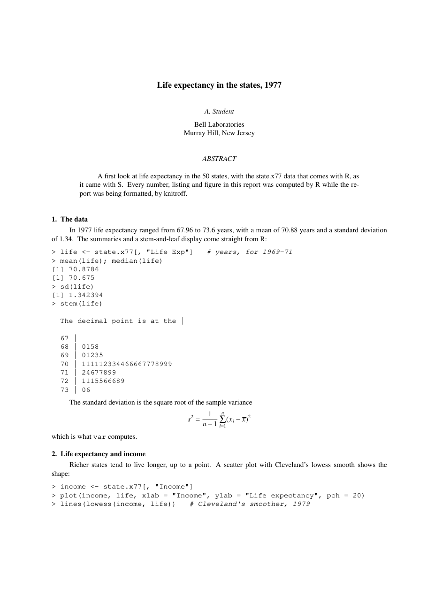
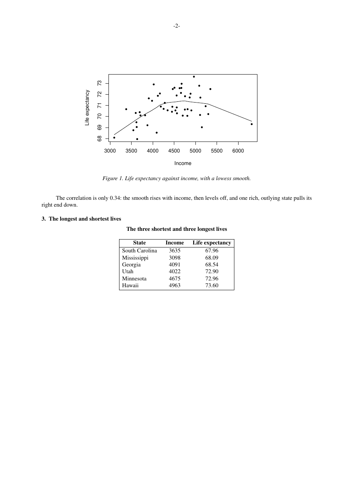

# knitroff

Dynamic reports in **troff**, with R. Write a report with the classic `-ms` macros, put R
code between `.SS` and `.SE`, and knitroff runs it with
[knitr](https://yihui.org/knitr/), then typesets the page with GNU groff. The output is a
PDF, a PostScript file, or a draft for the terminal.

```
.NH
The data
.PP
In 1977 life expectancy ranged from \*[lo] to \*[hi] years.
.SR lo min(state.x77[, "Life Exp"])
.SS summaries
life <- state.x77[, "Life Exp"]
mean(life); median(life)
.SE
```

```r
knitroff::render_roff("states.Rms")                   # states.pdf
knitroff::render_roff("states.Rms", format = "utf8")  # states.txt, for less -R
```

<p>
   prompts and its output including a stem-and-leaf display, and a typeset equation for the sample variance">
  
</p>

## The idea

troff has always worked this way. `eqn` finds the `.EQ`…`.EN` blocks in a document,
replaces them with plain troff and passes the rest through, and `tbl` does the same with
`.TS`…`.TE`. knitroff is one more preprocessor at the front of that pipeline, one that
runs R.

It began as `spp` in [Compute S like 1979](https://github.com/danielgccr/slike79), a
simulated UNIX/32V running Bell Labs S. There, `spp` is a what-if: every piece it needs
existed in 1981, but nobody joined them until Sweave in 2002. knitroff is the same idea
for R and groff today, and it can do what 1981 couldn't: put the figures on the page.

## Installing

```r
# install.packages("remotes")
remotes::install_github("danielgccr/knitroff")
```

knitroff needs **GNU groff** 1.22 or later to typeset: `render_roff()`. Most Linux
systems have it; on macOS, which switched its man pages to mandoc, install it with
`brew install groff`; on Windows, see [below](#windows). Figures in PDF need `pdfinfo`
from poppler.
`knit_roff()`, which only writes the troff, needs neither.

### Windows

groff runs on Windows through MSYS2, and R users already have MSYS2 inside
[Rtools](https://cran.r-project.org/bin/windows/Rtools/). groff (1.24.1) is in MSYS2's
`msys` sub-repository, which is the one CRAN's Rtools instructions say may be added to it.
In the **Rtools45 bash** shell (`C:\rtools45\msys2.exe` or the Start menu):

```
pacman -Sy groff
```

This also installs Perl, which groff's PDF driver needs. R puts Rtools' tools on its
`PATH`, so check in R:

```r
Sys.which("groff")   # e.g. "C:\\rtools45\\usr\\bin\\groff.exe"
```

If it comes back empty, give the path: `render_roff("report.Rms", groff = "C:/rtools45/usr/bin/groff.exe")`.

That is enough for PDF and PostScript with listings, equations and tables, and for the
terminal draft. **Figures in PDF** also need `pdfinfo` from poppler, and MSYS2 packages
poppler in its `ucrt64` sub-repository, which Rtools warns against mixing in. Get it
another way:

- **A separate MSYS2** (`C:\msys64`): `pacman -S groff mingw-w64-ucrt-x86_64-poppler`,
  then use that groff and put `C:\msys64\ucrt64\bin` on `PATH` for `pdfinfo`.
- **[Scoop](https://scoop.sh/)**: `scoop install poppler`, with groff from Rtools.
- **WSL**: Linux on Windows, where knitroff works as it does on Linux.

`knit_roff()` needs neither groff nor poppler, so writing the troff works anywhere.

## Writing a document

A document is troff with the [ms macros](https://www.gnu.org/software/groff/manual/groff.html)
(`.TL`, `.AU`, `.AI`, `.AB`/`.AE`, `.NH`, `.SH`, `.PP`, `.LP`, `.DS`/`.DE` …), saved as
`.Rms`. Three things are added:

| Write | And you get |
|---|---|
| `.SS` … `.SE` | an R chunk. Chunk options follow `.SS`, as in `.SS scatter, fig.cap="Income", echo=FALSE` |
| `` `r expr` `` | the value of `expr` in the text |
| `.SR name expr` | the troff string `\*[name]` set to the value of `expr`, as `spp` did |

Each chunk becomes **one listing** in a constant-width font, kept together on a page. The
code has `> ` and `+ ` prompts and its output follows, without `##`, the way an R session
looks. The characters `-`, `'`, `` ` ``, `^` and `~` in code stay plain ASCII in every
output, so code can be pasted back into R.

### Highlighting

Listings are highlighted the way printed listings were, without colour: R keywords, plus
`TRUE`, `FALSE`, `NULL`, `NA`, `Inf` and `NaN`, in **constant-width bold**, and comments in
*constant-width italic*. R's own parser finds the tokens. In the terminal draft, bold and
italic become the terminal's bold and underline.

You choose: `render_roff(..., highlight = FALSE)` gives the plain listing of 1981 for the
whole document, and a chunk can choose for itself with `.SS highlight=FALSE` or `TRUE`.
Output is never highlighted.

Everything else in the document goes to groff as it is, so `.EQ` equations, `.TS` tables
and `.PS` pictures work as usual: `render_roff()` runs `groff -ms -k -e -t -p`.

### Figures

A plot in a chunk goes on the page with `.PDFPIC` in PDF and `.PSPIC` in PostScript,
centred and numbered, with `fig.cap` as its caption. Control the size with `fig.width`,
`fig.height` and `out.width` (a troff length, such as `4i`).

A terminal can't show a picture, so the `utf8` draft leaves a box, as authors did before
figures could be typeset:

```
         +---------------------------------------------+
         |    Figure 1: paste up scatter-1.pdf here    |
         +---------------------------------------------+
 Figure 1. Life expectancy against income, with a lowess smooth.
```

### Tables

`roff_table()` turns a data frame into a `tbl` table: centred, boxed, with a bold header,
numeric columns aligned, and an optional caption. Make it the value of a chunk:

```
.SS extremes, echo=FALSE
knitroff::roff_table(head(mtcars[, 1:3]), caption = "Three columns of mtcars")
.SE
```

### Equations in the draft

groff can't set an equation on a terminal, because it drops eqn's half-line motions. So
the `utf8` draft shows the eqn source instead, which Kernighan and Cherry designed to read
the way you'd say it aloud:

```
s sup 2 ~=~ 1 over {n - 1} sum from i=1 to n ( x sub i - x bar ) sup 2
```

## Reference

The R help has a complete reference for writing knitroff documents, taken from the groff
manuals and marking which features are extensions to the 1979 Seventh Edition:

| Help page | Covers |
|---|---|
| `?ms` | every ms macro (`.TL`, `.PP`, `.NH`, `.IP`, `.DS`, `.FS`, …), register and string |
| `?troff` | requests (`.sp`, `.ce`, `.ft` …), escapes (`\fB`, `\*[name]` …), units, special characters |
| `?eqn` | the equation language: `sub`, `sup`, `over`, `sqrt`, `from`, `to`, matrices, Greek |
| `?tbl` | tables: options, column formats, data, text blocks |

## Functions

| Function | What it does |
|---|---|
| `render_roff(input, output, format = "pdf", highlight = TRUE)` | knits, then typesets with groff: `"pdf"`, `"ps"` or `"utf8"` |
| `knit_roff(input, output, format = "pdf", highlight = TRUE)` | knits to plain troff (`.ms`) only; no groff needed |
| `roff_table(x, caption, digits)` | a data frame as a `tbl` table |
| `hooks_roff()` | knitr's output hooks for troff, for driving `knitr::knit()` yourself |

`knit_roff()` restores knitr's patterns, hooks and options when it finishes, so it doesn't
interfere with other knitr documents in the same session.

## Editors and GitHub

The repository's `.gitattributes` tells GitHub to show `.Rms` files as Roff, so they are
highlighted there. RStudio's editor knows `.Rnw` and `.Rmd` but not `.Rms`, and has no way
to add a language, so it opens them as plain text, where its Insert Chunk shortcut and Knit
button do nothing.

knitroff gives RStudio two addins in their place, in the **Addins** menu:

| Addin | What it does |
|---|---|
| Insert troff chunk | wraps the selected lines in `.SS` and `.SE`, or inserts an empty chunk at the cursor |
| Render troff document | saves the `.Rms` file, runs `render_roff()` and opens the PDF |

A package can't bind keys, so bind them once in **Tools → Modify Keyboard Shortcuts** (search
for "troff"). Ctrl+Shift+Alt+I and Ctrl+Shift+Alt+K are free and sit next to RStudio's own
Ctrl+Alt+I and Ctrl+Shift+K; reusing those would take them away from `.Rmd` files.

In VS Code or Positron, a snippet does the first: add it to your user snippets, or to
`.vscode/knitroff.code-snippets` in a project, then type `ss` and Tab:

```json
{ "knitroff chunk": { "scope": "", "prefix": "ss", "body": [".SS $1", "$0", ".SE"] } }
```

In Vim or Neovim, the `nroff` syntax works: `vim.filetype.add({ extension = { Rms = "nroff" } })`.
A chunk is a mapping away: `vim.keymap.set("i", "<C-A-i>", ".SS<CR><CR>.SE<Up>")`.

## Vignettes

knitroff is a vignette engine. In your package's `DESCRIPTION`:

```
VignetteBuilder: knitroff
Suggests: knitroff
```

Start the `.Rms` vignette with R's two lines, at the beginning of the line (knitroff
removes them before formatting):

```
%\VignetteIndexEntry{My report}
%\VignetteEngine{knitroff::roff}
```

`R CMD build` then typesets the vignette to PDF, and `R CMD check` runs its code.

## The example

`inst/examples/states.Rms` is the report pictured above: life expectancy in the 50 states
in 1977, with strings from `.SR`, a listing, a stem-and-leaf display, an equation, a figure
with a lowess smooth, and a table.

```r
file.copy(system.file("examples", "states.Rms", package = "knitroff"), ".")
knitroff::render_roff("states.Rms")
```

## Limitations

- groff is required to typeset. CRAN's Windows check machines have Rtools but not groff,
  so the tests skip rendering there; `knit_roff()` works everywhere. On your own Windows
  machine, see [Windows](#windows).
- PDF figures run groff with `-U` (unsafe mode), because `.PDFPIC` asks `pdfinfo` for each
  picture's size. Render only documents you trust.
- The terminal draft shows equations as eqn source and figures as boxes to paste into.
- Inline numbers are formatted with `getOption("digits")`; round them in the expression,
  as in `` `r round(x, 2)` ``.
